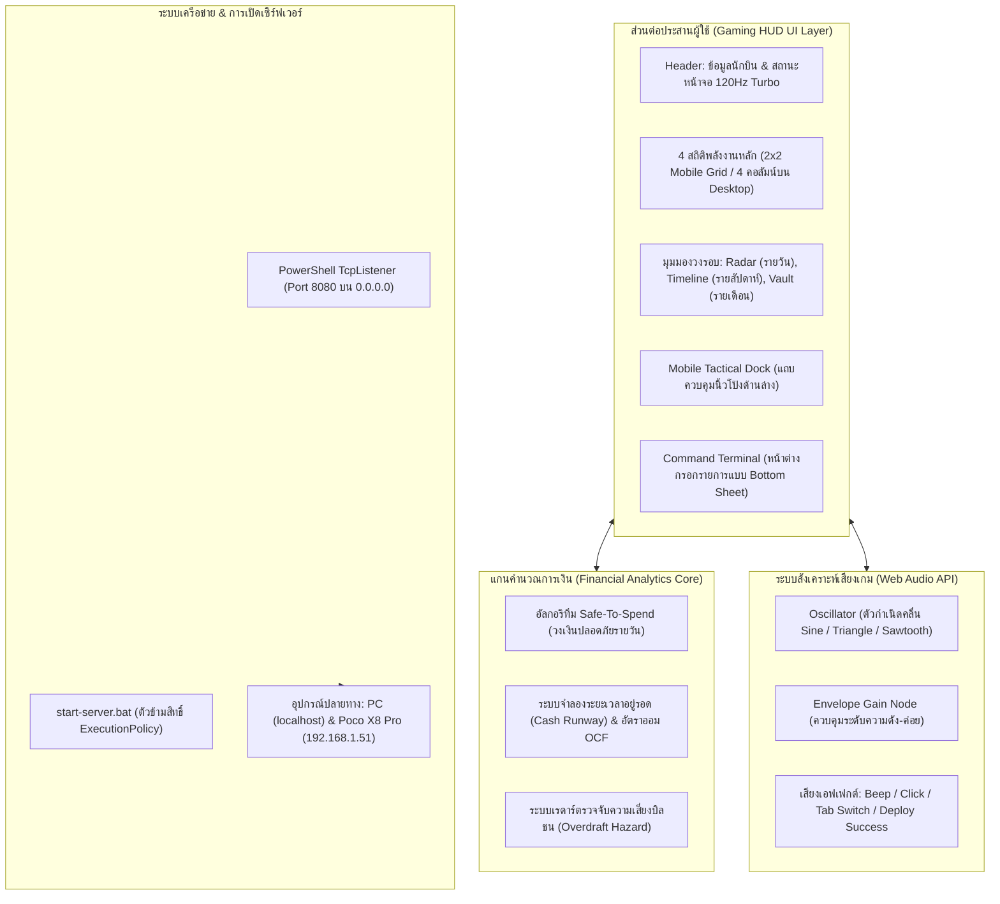

# 🎮 AntiGrav Cyber Gaming HUD: คู่มือการปรับปรุงระบบ (Migration Manual) และบทเรียนสถาปัตยกรรม

> **ประเภทเอกสาร:** คู่มือแนวทางการปรับปรุงระบบ (Migration Outline Manual) & เอกสารประกอบบทเรียน (Lesson Guide)  
> **อุปกรณ์เป้าหมาย:** Xiaomi Poco X8 Pro (หน้าจอ AMOLED 6.67", สัดส่วน 20:9) & Desktop Web  
> **รูปแบบธีม:** Cyberpunk / Sci-Fi Tactical Gaming HUD  
> **ชุดเทคโนโลยี:** HTML5, Tailwind CSS, Lucide Icons, Chart.js, Web Audio API, Vanilla JS, PowerShell  
> **วันที่บันทึก:** 2026-10-03  

> **เอกสารที่เกี่ยวข้อง:** [[plan|พิมพ์เขียวระบบการเงิน]] · [[test|บันทึกการทดสอบ]] · [[รายรับรายจ่าย/README|สมุดรายรับรายจ่าย]] · [[Welcome|หน้าหลักของ vault]]

---

## 📌 1. บทสรุปภาพรวมของเซสชัน (Executive Summary)

ในเซสชันการพัฒนานี้ เราได้ทำการยกเครื่องหน้าแดชบอร์ดบริหารการเงินเดิม (**AntiGrav Cash Flow**) ใหม่ทั้งหมด เพื่อตอบโจทย์ความต้องการหลัก 3 ประการ:
1. **การปรับแต่งสำหรับมือถือ Poco X8 Pro อย่างเต็มรูปแบบ**: ออกแบบตามหลักสรีรศาสตร์หน้าจอแนวตั้งสัดส่วนยาว 20:9 รองรับการควบคุมด้วยนิ้วโป้งมือเดียว (Single-handed Thumb Accessibility) พร้อมคำนึงถึง Safe-Area ป้องกันการทับซ้อนกับรูกล้อง Punch-hole และแถบ Gesture ด้านล่าง
2. **การแปลงโฉมเป็น Cyberpunk Gaming HUD**: เปลี่ยนหน้าตาเว็บองค์กรแบบเดิมให้กลายเป็นห้องควบคุมสั่งการสไตล์เกม Sci-Fi ล้ำสมัย โดยเลือกใช้ชุดฟอนต์ที่ให้กลิ่นอายเกมและรองรับภาษาไทยอย่างสมบูรณ์, มาตรวัดพลังงานนีออน, แถบเกราะป้องกันแอนิเมชัน และระบบเสียงสังเคราะห์ Game SFX ผ่าน Web Audio API แบบเรียลไทม์
3. **การเข้าถึงข้ามอุปกรณ์และการแก้ปัญหาสิทธิ์ Windows**: พัฒนา Local HTTP Server แบบไร้ Dependency ภายนอก (`server.ps1` และ `start-server.bat`) ช่วยให้อุปกรณ์มือถือ Poco X8 Pro เครื่องจริงสามารถเชื่อมต่อเข้ามาใช้งานผ่าน Wi-Fi วงเดียวกันได้ทันที โดยไม่ติดบล็อกระบบความปลอดภัย Windows Execution Policy

---

## 🧬 2. ผังพิมพ์เขียวสถาปัตยกรรม (Architectural Blueprint)



---

## 🎨 3. ระบบการออกแบบ Cyber Gaming HUD (Design System)

### 3.1. การเลือกใช้ฟอนต์: สูตรผสมฟอนต์เกมมิ่งภาษาไทย
ฟอนต์ภาษาไทยทั่วไป (เช่น Sarabun หรือ Thonburi) มักจะให้ความรู้สึกเป็นทางการแบบเอกสารสำนักงาน เพื่อให้ได้ความรู้สึก Sci-Fi / Mecha Gaming เหมือนหน้า HUD ของเกม *Apex Legends* หรือ *Cyberpunk 2077* โดยที่ตัวหนังสือภาษาไทยยังคงอ่านง่ายชัดเจน 100%:

| ชื่อฟอนต์ | หน้าที่ในระบบ | รองรับภาษา | เหตุผลในการเลือกใช้ |
| :--- | :--- | :--- | :--- |
| **`Chakra Petch`** | ข้อความหลัก / ป้ายภาษาไทย | ไทย + อังกฤษ | ออกแบบโดย Cadson Demak มีเส้นสายและมุมตัดเฉียงคล้ายเครื่องจักรกลยุทธวิธี เหมาะกับธีมเกมมากที่สุด |
| **`Orbitron`** | ตัวเลขการเงิน / หน้าปัดดิจิทัล | ตัวเลข / อังกฤษ | ฟอนต์เรขาคณิตแห่งอนาคต เหมาะกับการแสดงผลยอดเงินคงเหลือ เปอร์เซ็นต์ และตัวเลขขนาดใหญ่ |
| **`Share Tech Mono`** | ข้อมูล Log / พิกัด / Timestamp | ตัวเลข / ตัวอักษรความกว้างคงที่ | ให้ความรู้สึกเหมือนหน้าจอ Terminal บันทึกคำสั่งทางการทหารและโค้ดระบบ |

```html
<!-- โค้ดดึงฟอนต์จาก Google Fonts -->
<link href="https://fonts.googleapis.com/css2?family=Chakra+Petch:ital,wght@0,400;0,600;0,700;1,700&family=Orbitron:wght@600;800;900&family=Share+Tech+Mono&display=swap" rel="stylesheet">
```

### 3.2. ชุดคู่สี Matrix & Neon Palette
- **Void Canvas (พื้นหลังห้วงอวกาศ):** `#050811` (สีน้ำเงิน-ดำเข้มลึก)
- **Cyber Cyan (`#00f0ff`):** สีหลักของระบบ HUD, เส้นเรดาร์เรืองแสง, เส้นโค้งคาดการณ์ Safe-to-Spend
- **Matrix Emerald (`#00ff9d`):** สถานะสุขภาพการเงินดีเยี่ยม, กระสุนรายรับเข้า (Inflow), หลอดพลังงาน 100%
- **Danger Rose (`#ff2a5f`):** กระสุนรายจ่ายออก (Outflow), ความเสียหาย, การแจ้งเตือนบิลชน
- **Solar Amber (`#ffaa00`):** ยอดกันไว้จ่ายบัตรเครดิต (Escrow Hold), สัญญาณเตือนสไปก์การใช้จ่าย
- **Arcane Purple (`#b026ff`):** เป้าหมายเงินออม, รายการโอนย้ายคลัง, บัฟค่าประสบการณ์ XP

### 3.3. ขอบมุมเหลี่ยมเฉียงสไตล์เกราะยุทธวิธี (Chamfered Corners ด้วย `clip-path`)
แทนที่จะใช้มุมโค้งมนแบบเว็บทั่วไป (`rounded-xl`) เราใช้เทคนิค CSS `clip-path` ตัดมุม 45 องศา เพื่อสร้างความรู้สึกเหมือนแผ่นเกราะหุ่นยนต์:
```css
/* ตัดมุมเฉียง 12px แบบสมมาตร */
.clip-corner {
  clip-path: polygon(0 0, calc(100% - 12px) 0, 100% 12px, 100% 100%, 12px 100%, 0 calc(100% - 12px));
}

/* ตัดมุมเฉียงสำหรับหน้าต่างที่สไลด์ขึ้นจากด้านล่าง */
.clip-corner-top {
  clip-path: polygon(0 10px, 10px 0, calc(100% - 10px) 0, 100% 10px, 100% 100%, 0 100%);
}
```

### 3.4. หลอดพลังงานเกราะป้องกัน Safe-to-Spend (Shield Energy Gauge)
จำลองหลอดเลือดหรือเกราะป้องกันของตัวละครในเกมด้วย CSS Gradients และแอนิเมชันลายทางเคลื่อนไหว:
```css
.energy-bar-fill {
  background: linear-gradient(90deg, #00ff9d 0%, #00f0ff 100%);
  background-size: 20px 20px;
  background-image: linear-gradient(
    45deg, 
    rgba(255, 255, 255, 0.15) 25%, 
    transparent 25%, 
    transparent 50%, 
    rgba(255, 255, 255, 0.15) 50%, 
    rgba(255, 255, 255, 0.15) 75%, 
    transparent 75%, 
    transparent
  );
  animation: energyStripes 1.2s linear infinite;
}
@keyframes energyStripes {
  0% { background-position: 0 0; }
  100% { background-position: 40px 0; }
}
```

---

## 🔊 4. ระบบสังเคราะห์เสียง Game SFX ไร้ไฟล์ภายนอก (Web Audio API)

แทนที่จะต้องแนบไฟล์ `.mp3` หรือ `.wav` ซึ่งทำให้เปลือง Bandwidth มีโอกาสโหลดไม่ทัน และมักถูกเบราว์เซอร์บล็อก Autoplay เราได้สร้าง Sound Synthesizer ขึ้นมาจาก Web Audio API ภายใน `app.js` โดยตรง:

```javascript
const AudioEngine = {
  ctx: null,
  enabled: true,

  init() {
    if (!this.ctx && (window.AudioContext || window.webkitAudioContext)) {
      this.ctx = new (window.AudioContext || window.webkitAudioContext)();
    }
  },

  playBeep(freq = 600, duration = 0.08, type = 'sine') {
    if (!this.enabled) return;
    try {
      this.init();
      if (!this.ctx) return;
      if (this.ctx.state === 'suspended') this.ctx.resume();
      
      const osc = this.ctx.createOscillator();
      const gain = this.ctx.createGain();
      osc.type = type;
      osc.frequency.setValueAtTime(freq, this.ctx.currentTime);
      gain.gain.setValueAtTime(0.06, this.ctx.currentTime);
      gain.gain.exponentialRampToValueAtTime(0.001, this.ctx.currentTime + duration);
      osc.connect(gain);
      gain.connect(this.ctx.destination);
      osc.start();
      osc.stop(this.ctx.currentTime + duration);
    } catch (e) {}
  },

  click()   { this.playBeep(880, 0.05, 'triangle'); },
  tab()     { this.playBeep(1100, 0.07, 'sine'); },
  action()  { this.playBeep(480, 0.04, 'sawtooth'); setTimeout(() => this.playBeep(960, 0.07, 'sine'), 40); },
  success() { this.playBeep(587.33, 0.06, 'triangle'); setTimeout(() => this.playBeep(880, 0.1, 'sine'), 60); }
};
```

---

## 📱 5. การออกแบบตามหลักสรีรศาสตร์บนมือถือ Poco X8 Pro

### 5.1. สัดส่วนจอ 20:9 และระยะเอื้อมของนิ้วโป้ง (Thumb Zone)
Poco X8 Pro มีขนาดจอ 6.67 นิ้ว สัดส่วนแนวยาวพิเศษ (~412 x 915 พิกเซลทาง CSS) การใช้งานด้วยมือข้างเดียวจะจำกัดอยู่เฉพาะพื้นที่ครึ่งล่างของจอ

#### การตัดสินใจเชิงวิศวกรรม UI:
1. **การจัดเรียง 4 สถิติหลักแบบ 2x2 Grid:**
   - *บนคอมพิวเตอร์:* วางเรียงแถวเดียว 4 คอลัมน์ (`lg:grid-cols-4`)
   - *แบบมือถือทั่วไป (UX ไม่ดี):* เรียงต่อกันลงมาเป็น 4 บล็อกยาว ทำให้ต้องเลื่อนจอกว่า 800px ถึงจะเห็นกราฟ
   - *การปรับแต่งสำหรับ Poco X8 Pro (ทางออกของเรา):* ใช้คลาส `grid-cols-2 lg:grid-cols-4` ทำให้การ์ดจัดกลุ่มเป็น 2 แถว x 2 คอลัมน์ กินพื้นที่แนวตั้งเพียง ~220px ผู้ใช้จึงมองเห็นสัญญาณชีพทางการเงินครบทั้ง 4 ตัวทันทีในหน้าจอแรกโดยไม่ต้องเลื่อนจอลง
2. **Tactical Bottom Navigation Dock (แถบควบคุมนิ้วโป้ง):**
   - ซ่อนแถบเมนูด้านบนบนมือถือ (`hidden md:flex`)
   - ย้ายมาไว้ที่แถบล่างสุดที่มีระดับความลอย `z-50`:
     - **RADAR (รายวัน)**
     - **TIMELINE (รายสัปดาห์)**
     - **Floating Action Core (`+`):** ปุ่มบวกกลมเรืองแสงขนาดใหญ่ตรงกลาง วางอยู่ในตำแหน่งที่นิ้วโป้งกดถึงง่ายที่สุด
     - **VAULT (รายเดือน)**
     - **SFX:** ปุ่มเปิด/ปิดเสียงเอฟเฟกต์
3. **หน้าต่างบันทึกรายการแบบ Bottom Sheet:**
   - บนคอมพิวเตอร์: เปิดเป็น Modal กลางจอ (`sm:items-center`)
   - บนมือถือ: สไลด์ขึ้นมาจากขอบล่าง (`items-end p-0`) ช่วยให้ช่องกรอกและปุ่มเลือกอยู่ใกล้จุดพักนิ้วโป้ง
4. **การรองรับ Safe-Area:**
   ```html
   <meta name="viewport" content="width=device-width, initial-scale=1.0, maximum-scale=1.0, user-scalable=no, viewport-fit=cover">
   ```
   - ขอบบน: `pt-[max(env(safe-area-inset-top),0.6rem)]` (เว้นระยะรูกล้อง Punch-hole)
   - ขอบล่าง: `pb-[max(env(safe-area-inset-bottom),0.6rem)]` (เว้นระยะแถบควบคุม Gesture Bar ของระบบ)

---

## 🚀 6. การรัน Local Server และการแก้ปัญหาสิทธิ์ Windows

### 6.1. เหตุผลที่เลือก `TcpListener` แทน `HttpListener`
- ตัวคลาส `System.Net.HttpListener` ของ Windows มีระบบตรวจสิทธิ์ URL ACL ที่เข้มงวด การสั่งผูกกับ IP ภายนอก (เช่น `http://192.168.1.51:8080`) โดยไม่รันแบบ Administrator จะส่งผลให้เกิดข้อผิดพลาด:
  `HTTP Error 400. The request hostname is invalid.`
- **วิธีแก้ใน `server.ps1`:** เราเปลี่ยนมาใช้คลาส `System.Net.Sockets.TcpListener` และผูกกับ `[System.Net.IPAddress]::Any (0.0.0.0)` บนพอร์ต 8080 ทำให้ User ทั่วไปสามารถแชร์เว็บให้มือถือที่เกาะ Wi-Fi วงเดียวกันเปิดเข้ามาได้ทันทีโดยไม่ต้องใช้สิทธิ์ Admin

### 6.2. การแก้ปัญหาบล็อกสิทธิ์ PowerShell Execution Policy
เมื่อผู้ใช้รันไฟล์สคริปต์ `.ps1` บน Windows มักจะเจอกับข้อผิดพลาด:
> *File server.ps1 cannot be loaded because running scripts is disabled on this system (PSSecurityException)*

#### 3 แนวทางแก้ไข:
1. **ใช้ตัวเปิดแบบดับเบิลคลิก (`start-server.bat`) — สะดวกที่สุด:**
   ```cmd
   @echo off
   cd /d "%~dp0"
   powershell -NoProfile -ExecutionPolicy Bypass -File "%~dp0server.ps1"
   pause
   ```
   ผู้ใช้เพียงแค่ดับเบิลคลิกไฟล์นี้ในโฟลเดอร์ Windows Explorer ก็จะเริ่มทำงานทันทีโดยไม่ต้องเปิด Terminal
2. **ปลดล็อกสิทธิ์ถาวรสำหรับ User ปัจจุบัน (ไม่ต้องเป็น Admin):**
   ```powershell
   Set-ExecutionPolicy -ExecutionPolicy RemoteSigned -Scope CurrentUser
   ```
3. **สั่งรันแบบข้ามสิทธิ์เฉพาะครั้งนี้ (Bypass via CLI):**
   ```powershell
   powershell -ExecutionPolicy Bypass -File .\server.ps1
   ```

---

## 📖 7. บทเรียนสำคัญสำหรับการนำไปสอน (Teaching & Developer Takeaways)

1. **บทเรียนที่ 1: ความสวยงามต้องส่งเสริมความเร็วในการรับรู้ (Cognitive Efficiency)**  
   ธีม Gaming HUD ไม่ได้มีไว้เพื่อความเท่เพียงอย่างเดียว สีและมาตรวัด (สีเขียว = ปลอดภัย, สีแดง = บิลชน) ช่วยให้ผู้ใช้เข้าใจสถานะการเงินของตัวเองได้เร็วกว่าการอ่านตารางตัวเลขทั่วไปหลายเท่า
2. **บทเรียนที่ 2: สถาปัตยกรรมแบบ Zero-Dependency ช่วยให้ Prototype ได้เร็วที่สุด**  
   ด้วยการผสาน Tailwind CDN, Lucide, Chart.js และ Web Audio API เข้าด้วยกัน เว็บแอปพลิเคชันที่มีเอฟเฟกต์ระดับสูงชิ้นนี้**ไม่ต้องติดตั้งแพ็กเกจ npm ไม่ต้องมีโฟลเดอร์ node_modules และไม่ต้องผ่านขั้นตอนการ Build ใดๆ ทั้งสิ้น**
3. **บทเรียนที่ 3: การออกแบบ Mobile-First คือการคำนึงถึงสรีระนิ้ว ไม่ใช่แค่ Media Queries**  
   การทำหน้าเว็บให้ Responsive อย่างแท้จริง ต้องวิเคราะห์จุดที่นิ้วโป้งของผู้ใช้วางอยู่บนตัวเครื่องจริง (โดยเฉพาะจอยาว 20:9 แบบ Poco X8 Pro) และนำจุดสั่งการสำคัญทั้งหมดลงมาไว้ที่ 40% ล่างสุดของหน้าจอ
4. **บทเรียนที่ 4: สำหรับฝั่ง Windows จงเตรียมไฟล์ `.bat` เอาไว้เสมอ**  
   แม้โปรแกรมเมอร์จะคุ้นเคยกับคำสั่งใน PowerShell แต่ผู้ใช้งานทั่วไปหรือผู้เรียนจะประทับใจความง่ายในการดับเบิลคลิกไฟล์ `.bat` เพียงครั้งเดียวแล้วพร้อมใช้งานทันที

---

## 📂 8. สรุปรายการไฟล์ในโปรเจกต์ (File Inventory)

- **[`index.html`](file:///c:/GED/AntiGrav/index.html):** โครงสร้างหน้าเว็บหลัก, การตั้งค่าธีม Tailwind Cyber, การ์ด 2x2 Grid และ Mobile Bottom Dock
- **[`app.js`](file:///c:/GED/AntiGrav/app.js):** เอนจินคำนวณกระแสเงินสด, ระบบเสียงสังเคราะห์ Web Audio, ธีมกราฟนีออน Chart.js และตัวสลับแท็บ
- **[`server.ps1`](file:///c:/GED/AntiGrav/server.ps1):** Local HTTP Server ภาษา PowerShell แบบเปิดให้ต่อผ่าน LAN Wi-Fi ได้ (`0.0.0.0:8080`)
- **[`start-server.bat`](file:///c:/GED/AntiGrav/start-server.bat):** ตัวเปิดเซิร์ฟเวอร์แบบดับเบิลคลิก พร้อมแก้ปัญหา Execution Policy อัตโนมัติ
- **[`Brain/manual.md`](file:///c:/GED/AntiGrav/Brain/manual.md):** เอกสารคู่มือฉบับนี้ (ภาษาไทย)
- **[`Brain/plan.md`](file:///c:/GED/AntiGrav/Brain/plan.md):** พิมพ์เขียวเชิงสถาปัตยกรรมและอัลกอริทึมการเงินส่วนบุคคลฉบับเต็ม
