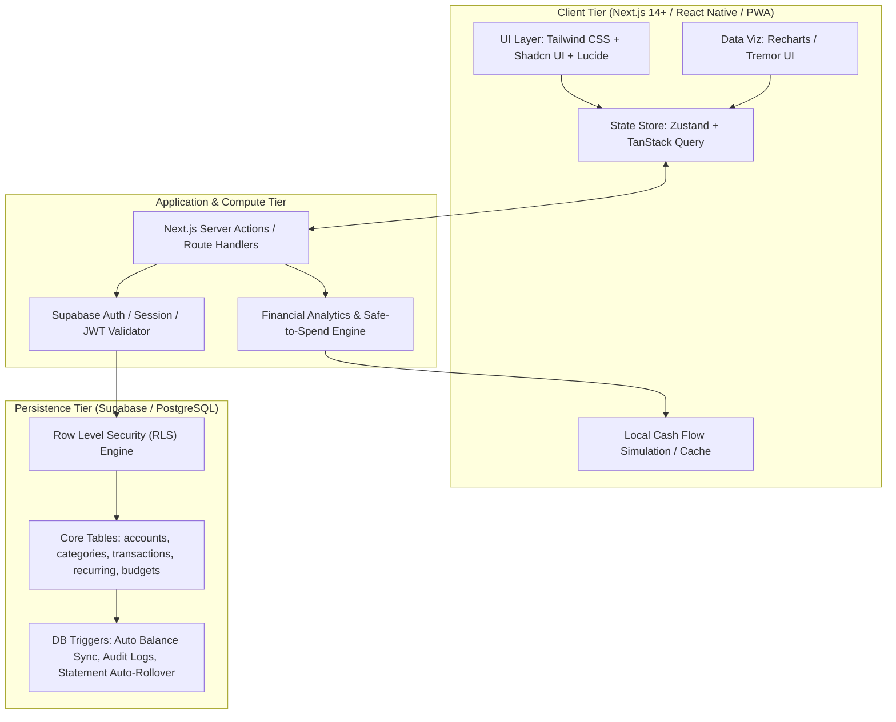

# 🧭 Personal Expense & Cash Flow Management App Blueprint

> **เอกสารที่เกี่ยวข้อง:** [[manual|คู่มือแอปและเซิร์ฟเวอร์]] · [[test|บันทึกการทดสอบ]] · [[รายรับรายจ่าย/README|สมุดรายรับรายจ่าย]] · [[Welcome|หน้าหลักของ vault]]

> [!ABSTRACT] Executive Summary
> พิมพ์เขียวทางสถาปัตยกรรม (System Blueprint) และคู่มือการพัฒนาระบบ **Personal Expense & Cash Flow Management Application** โดยมุ่งเน้นการแก้ปัญหาหลักของการเงินส่วนบุคคล: **"การบริหารเงินสด สภาพคล่อง (Liquidity) และการพยากรณ์กระแสเงินสดล่วงหน้า (Predictive Cash Flow)"** เพื่อป้องกันปัญหาเงินขาดมือ (Cash Shortfall) และช่วยวางแผนการใช้จ่ายจริงอย่างสบายใจ (Safe-to-Spend)

---

## 🏗️ 1. System Architecture Overview



---

## 🎯 2. Core Functional Specifications

### 2.1 Core Data Entry & Multi-Account Structure
* **Transaction Types:**
  - `income`: รับเข้าบัญชีปลายทาง
  - `expense`: จ่ายออกจากบัญชีต้นทาง
  - `transfer`: โอนระหว่างบัญชี (ไม่นับเป็น P&L)
* **Account Classification:**
  - `Cash`: เงินสดในกระเป๋า
  - `Bank`: บัญชีกระแสรายวัน / ออมทรัพย์พร้อมใช้
  - `Credit Card`: บัตรเครดิต (มีรอบตัดบิล Statement Date และรอบชำระ Due Date)
  - `Savings / Investment`: บัญชีสะสมทรัพย์/ลงทุน (แยกชั้น Liquidity)
* **Metadata Fields:** Category, Sub-category, Tags (Array), Timestamp, Location, Receipt Image URL, Split Tags.
* **Recurring Rules:** รองรับความถี่ Daily, Weekly, Biweekly, Monthly, Quarterly, Yearly พร้อมระบบคำนวณวันถัดไปอัตโนมัติ

---

### 2.2 Dashboard Time Horizons (3 Views)

| Horizon | Core Focus | Key Metrics & Data Visualizations |
| :--- | :--- | :--- |
| **Daily View** | ป้องกันการใช้จ่ายเกินมือในแต่ละวัน | - **Safe-to-Spend Today:** วงเงินที่ใช้ได้ต่อวันหลังหัก Fixed Expense & Savings<br>- **Today's Net Cash Movement:** รายรับ - รายจ่ายวันนี้<br>- Real-time Expense Gauge Bar |
| **Weekly View** | ติดตามจังหวะกระแสเงินและตรวจจับค่าใช้จ่ายก้อนโต | - **Weekly Cash Flow Comparative:** เทียบ Inflow vs Outflow 4 สัปดาห์<br>- **Spike Day Detector:** ไฮไลต์วันที่มียอดใช้จ่ายสูงผิดปกติจากค่าเฉลี่ย<br>- Weekly Net Accumulation Curve |
| **Monthly View** | สภาพคล่องระยะยาว และสุขภาพการเงินองค์รวม | - **Income vs. Expense vs. Net Savings Rate (%)**<br>- **Category Breakdown (Donut Chart)**<br>- **Burn Rate & Runway Analysis:** เงินสดคงเหลืออยู่รอดได้กี่เดือน |

---

## 🗄️ 3. Database Schema (PostgreSQL / Supabase DDL)

> [!INFO] Financial Accuracy Guard
> ใช้ชนิดข้อมูล `NUMERIC(15, 2)` สำหรับทุกค่าตัวเลขทางการเงิน เพื่อป้องกันข้อผิดพลาดการปัดเศษจาก IEEE 754 Floating-Point พร้อมเปิดใช้ RLS ทุกตาราง

```sql
-- 1. ENUM TYPES
CREATE TYPE account_type AS ENUM ('cash', 'bank', 'credit_card', 'savings', 'investment');
CREATE TYPE transaction_type AS ENUM ('income', 'expense', 'transfer');
CREATE TYPE recurrence_frequency AS ENUM ('daily', 'weekly', 'biweekly', 'monthly', 'quarterly', 'yearly');

-- 2. ACCOUNTS TABLE
CREATE TABLE public.accounts (
    id UUID PRIMARY KEY DEFAULT gen_random_uuid(),
    user_id UUID NOT NULL REFERENCES auth.users(id) ON DELETE CASCADE,
    name VARCHAR(100) NOT NULL,
    type account_type NOT NULL DEFAULT 'bank',
    currency VARCHAR(3) NOT NULL DEFAULT 'THB',
    current_balance NUMERIC(15, 2) NOT NULL DEFAULT 0.00,
    credit_limit NUMERIC(15, 2) DEFAULT 0.00,
    statement_closing_day INT CHECK (statement_closing_day BETWEEN 1 AND 31),
    payment_due_day INT CHECK (payment_due_day BETWEEN 1 AND 31),
    is_liquid BOOLEAN NOT NULL DEFAULT true, -- บัญชีที่นำมาคำนวณ Safe-to-Spend
    is_active BOOLEAN NOT NULL DEFAULT true,
    created_at TIMESTAMPTZ NOT NULL DEFAULT NOW(),
    updated_at TIMESTAMPTZ NOT NULL DEFAULT NOW()
);

-- 3. CATEGORIES TABLE
CREATE TABLE public.categories (
    id UUID PRIMARY KEY DEFAULT gen_random_uuid(),
    user_id UUID NOT NULL REFERENCES auth.users(id) ON DELETE CASCADE,
    name VARCHAR(100) NOT NULL,
    parent_id UUID REFERENCES public.categories(id) ON DELETE SET NULL,
    icon VARCHAR(50),
    color VARCHAR(20),
    type transaction_type NOT NULL,
    is_fixed_obligation BOOLEAN NOT NULL DEFAULT false, -- แยก Fixed Bill vs Discretionary
    created_at TIMESTAMPTZ NOT NULL DEFAULT NOW()
);

-- 4. RECURRING SCHEDULES (Subscriptions, Mortgages, Salaries)
CREATE TABLE public.recurring_rules (
    id UUID PRIMARY KEY DEFAULT gen_random_uuid(),
    user_id UUID NOT NULL REFERENCES auth.users(id) ON DELETE CASCADE,
    account_id UUID NOT NULL REFERENCES public.accounts(id) ON DELETE CASCADE,
    category_id UUID NOT NULL REFERENCES public.categories(id) ON DELETE RESTRICT,
    type transaction_type NOT NULL,
    amount NUMERIC(15, 2) NOT NULL CHECK (amount > 0),
    frequency recurrence_frequency NOT NULL,
    start_date DATE NOT NULL,
    end_date DATE,
    next_occurrence DATE NOT NULL,
    auto_create BOOLEAN NOT NULL DEFAULT false,
    description TEXT,
    created_at TIMESTAMPTZ NOT NULL DEFAULT NOW()
);

-- 5. TRANSACTIONS TABLE
CREATE TABLE public.transactions (
    id UUID PRIMARY KEY DEFAULT gen_random_uuid(),
    user_id UUID NOT NULL REFERENCES auth.users(id) ON DELETE CASCADE,
    type transaction_type NOT NULL,
    amount NUMERIC(15, 2) NOT NULL CHECK (amount > 0),
    source_account_id UUID REFERENCES public.accounts(id) ON DELETE RESTRICT,
    destination_account_id UUID REFERENCES public.accounts(id) ON DELETE RESTRICT,
    category_id UUID REFERENCES public.categories(id) ON DELETE RESTRICT,
    recurring_rule_id UUID REFERENCES public.recurring_rules(id) ON DELETE SET NULL,
    transacted_at TIMESTAMPTZ NOT NULL DEFAULT NOW(),
    tags TEXT[] DEFAULT '{}',
    notes TEXT,
    is_cleared BOOLEAN NOT NULL DEFAULT true,
    created_at TIMESTAMPTZ NOT NULL DEFAULT NOW(),
    
    CONSTRAINT check_transaction_accounts CHECK (
        (type = 'income' AND destination_account_id IS NOT NULL) OR
        (type = 'expense' AND source_account_id IS NOT NULL) OR
        (type = 'transfer' AND source_account_id IS NOT NULL AND destination_account_id IS NOT NULL 
                          AND source_account_id <> destination_account_id)
    )
);

-- 6. BUDGETS TABLE
CREATE TABLE public.budgets (
    id UUID PRIMARY KEY DEFAULT gen_random_uuid(),
    user_id UUID NOT NULL REFERENCES auth.users(id) ON DELETE CASCADE,
    category_id UUID NOT NULL REFERENCES public.categories(id) ON DELETE CASCADE,
    period_month DATE NOT NULL,
    allocated_amount NUMERIC(15, 2) NOT NULL CHECK (allocated_amount >= 0),
    savings_target NUMERIC(15, 2) NOT NULL DEFAULT 0.00,
    created_at TIMESTAMPTZ NOT NULL DEFAULT NOW(),
    UNIQUE (user_id, category_id, period_month)
);

-- PERFORMANCE INDEXES
CREATE INDEX idx_transactions_user_date ON public.transactions(user_id, transacted_at DESC);
CREATE INDEX idx_transactions_source_acc ON public.transactions(source_account_id);
CREATE INDEX idx_transactions_dest_acc ON public.transactions(destination_account_id);
CREATE INDEX idx_recurring_next_occurrence ON public.recurring_rules(next_occurrence) WHERE auto_create = true;

-- ROW LEVEL SECURITY (RLS) POLICIES
ALTER TABLE public.accounts ENABLE ROW LEVEL SECURITY;
ALTER TABLE public.categories ENABLE ROW LEVEL SECURITY;
ALTER TABLE public.transactions ENABLE ROW LEVEL SECURITY;
ALTER TABLE public.recurring_rules ENABLE ROW LEVEL SECURITY;
ALTER TABLE public.budgets ENABLE ROW LEVEL SECURITY;

CREATE POLICY "account_isolation_policy" ON public.accounts FOR ALL USING (auth.uid() = user_id);
CREATE POLICY "category_isolation_policy" ON public.categories FOR ALL USING (auth.uid() = user_id);
CREATE POLICY "transaction_isolation_policy" ON public.transactions FOR ALL USING (auth.uid() = user_id);
CREATE POLICY "recurring_isolation_policy" ON public.recurring_rules FOR ALL USING (auth.uid() = user_id);
CREATE POLICY "budget_isolation_policy" ON public.budgets FOR ALL USING (auth.uid() = user_id);
```

---

## ⚡ 4. Cash Flow Analytics Engine (TypeScript)

> [!TIP] Pure Function Design
> ฟังก์ชันคำนวณทั้งหมดถูกออกแบบให้เป็น **Pure Functions** เพื่อให้ง่ายต่อการทำ Unit Test และสามารถรันได้ทั้งบน Client (Zustand/Offline Mode) และ Server (Next.js Server Actions)

```typescript
// lib/analytics/cashflow.ts

export interface SafeToSpendInput {
  totalLiquidCash: number;        // ยอดรวมบัญชี Cash + Bank ที่มีสภาพคล่อง
  upcomingFixedExpenses: number;  // ภาระที่ต้องจ่ายแน่นอนก่อนสิ้นรอบเดือน (Fixed Obligations)
  monthlySavingsTarget: number;   // เป้าหมายเงินออมประจำเดือน
  accumulatedSavings: number;     // เงินที่ออมเข้าบัญชีเป้าหมายไปแล้วในเดือนนี้
  daysRemainingInPeriod: number;  // จำนวนวันที่เหลือในรอบเดือน
}

export interface SafeToSpendResult {
  totalSafeToSpend: number;
  dailySafeToSpend: number;
  discretionaryBuffer: number;
}

/**
 * คำนวณเงินที่ใช้จ่ายได้อย่างปลอดภัย (Safe-to-Spend)
 */
export function calculateSafeToSpend(input: SafeToSpendInput): SafeToSpendResult {
  const {
    totalLiquidCash,
    upcomingFixedExpenses,
    monthlySavingsTarget,
    accumulatedSavings,
    daysRemainingInPeriod,
  } = input;

  const remainingSavingsGoal = Math.max(0, monthlySavingsTarget - accumulatedSavings);
  
  // Total Free Cash = เงินสด - ค่าใช้จ่ายประจำที่ต้องจ่าย - ยอดเงินออมที่ยังค้างเก็บ
  const rawSafeAmount = totalLiquidCash - upcomingFixedExpenses - remainingSavingsGoal;
  
  // สำรอง Buffer 5% เผื่อค่าใช้จ่ายฉุกเฉิน
  const discretionaryBuffer = Math.max(0, rawSafeAmount * 0.05);
  const totalSafeToSpend = Math.max(0, rawSafeAmount - discretionaryBuffer);
  
  const daily = daysRemainingInPeriod > 0 ? totalSafeToSpend / daysRemainingInPeriod : 0;

  return {
    totalSafeToSpend: Number(totalSafeToSpend.toFixed(2)),
    dailySafeToSpend: Number(daily.toFixed(2)),
    discretionaryBuffer: Number(discretionaryBuffer.toFixed(2)),
  };
}

export interface UpcomingObligation {
  id: string;
  name: string;
  amount: number;
  dueDate: string; // ISO format: YYYY-MM-DD
}

export interface ForecastDay {
  date: string;
  projectedBalance: number;
  scheduledInflows: number;
  scheduledOutflows: number;
  isOverdraftHazard: boolean;
}

/**
 * ประเมินกระแสเงินสดคงเหลือล่วงหน้า (Predictive Cash Flow Forecast)
 */
export function generateCashFlowForecast(
  startingBalance: number,
  scheduledTransactions: UpcomingObligation[],
  avgDailyDiscretionarySpend: number,
  forecastDays: number = 30
): ForecastDay[] {
  const forecast: ForecastDay[] = [];
  let currentBalance = startingBalance;
  const today = new Date();

  for (let i = 0; i < forecastDays; i++) {
    const targetDate = new Date(today);
    targetDate.setDate(today.getDate() + i);
    const dateStr = targetDate.toISOString().split('T')[0];

    const dayObligations = scheduledTransactions.filter(
      (tx) => tx.dueDate.split('T')[0] === dateStr
    );
    
    const inflows = dayObligations
      .filter((o) => o.amount > 0)
      .reduce((sum, o) => sum + o.amount, 0);

    const outflows = dayObligations
      .filter((o) => o.amount < 0)
      .reduce((sum, o) => sum + Math.abs(o.amount), 0);

    // ปรับลดยอดตามค่ากินอยู่เฉลี่ยต่อวัน
    currentBalance = currentBalance + inflows - outflows - avgDailyDiscretionarySpend;

    forecast.push({
      date: dateStr,
      projectedBalance: Number(currentBalance.toFixed(2)),
      scheduledInflows: inflows,
      scheduledOutflows: outflows,
      isOverdraftHazard: currentBalance < 0,
    });
  }

  return forecast;
}

export interface HealthMetrics {
  operatingCashFlowRatio: number; // Income / Expense
  savingsRatePercentage: number;   // (Net Savings / Income) * 100
  runwayMonths: number;            // Liquid Balance / Monthly Burn Rate
}

/**
 * คำนวณดัชนีสุขภาพการเงิน (Financial Health Indicator Metrics)
 */
export function calculateHealthMetrics(
  totalIncome: number,
  totalExpense: number,
  liquidBalance: number,
  monthlyFixedExpense: number
): HealthMetrics {
  const operatingRatio = totalExpense > 0 ? totalIncome / totalExpense : totalIncome > 0 ? 99 : 0;
  const netSavings = Math.max(0, totalIncome - totalExpense);
  const savingsRate = totalIncome > 0 ? (netSavings / totalIncome) * 100 : 0;
  
  const baselineMonthlyBurn = totalExpense > 0 ? totalExpense : monthlyFixedExpense;
  const runway = baselineMonthlyBurn > 0 ? liquidBalance / baselineMonthlyBurn : 99;

  return {
    operatingCashFlowRatio: Number(operatingRatio.toFixed(2)),
    savingsRatePercentage: Number(savingsRate.toFixed(1)),
    runwayMonths: Number(runway.toFixed(1)),
  };
}
```

---

## 💻 5. Next.js Dashboard Implementation (App Router + Tailwind)

```tsx
// app/dashboard/page.tsx
'use client';

import React, { useState } from 'react';
import { 
  ArrowUpRight, 
  ArrowDownRight, 
  ShieldCheck, 
  AlertTriangle, 
  Wallet, 
  Calendar 
} from 'lucide-react';
import { 
  BarChart, 
  Bar, 
  XAxis, 
  YAxis, 
  Tooltip, 
  ResponsiveContainer, 
  AreaChart, 
  Area 
} from 'recharts';

export default function DashboardPage() {
  const [horizon, setHorizon] = useState<'daily' | 'weekly' | 'monthly'>('daily');

  // Metrics Data Simulation
  const metrics = {
    liquidBalance: 125400,
    dailySafeSpend: 850,
    todaySpent: 420,
    runwayMonths: 4.2,
    savingsRate: 28.5,
  };

  const weeklyTrendData = [
    { name: 'W1', inflow: 45000, outflow: 12000 },
    { name: 'W2', inflow: 5000, outflow: 18500 }, // Spike day
    { name: 'W3', inflow: 2000, outflow: 9400 },
    { name: 'W4 (Est)', inflow: 0, outflow: 11000 },
  ];

  const forecastData = [
    { date: '10/03', balance: 125400 },
    { date: '10/10', balance: 118000 },
    { date: '10/17', balance: 104500 },
    { date: '10/24', balance: 89000 },
    { date: '10/31', balance: 82500 },
  ];

  return (
    <div className="min-h-screen bg-slate-950 text-slate-100 p-4 md:p-8">
      {/* 1. Header & Horizon Switcher */}
      <header className="flex flex-col md:flex-row md:items-center justify-between pb-6 border-b border-slate-800 gap-4">
        <div>
          <h1 className="text-2xl font-bold tracking-tight">Financial Command Center</h1>
          <p className="text-slate-400 text-sm">การบริหารกระแสเงินสดและประเมินสภาพคล่องแบบเรียลไทม์</p>
        </div>
        
        <div className="flex bg-slate-900 p-1 rounded-xl border border-slate-800 self-start md:self-auto">
          {(['daily', 'weekly', 'monthly'] as const).map((view) => (
            <button
              key={view}
              onClick={() => setHorizon(view)}
              className={`px-4 py-1.5 text-xs font-semibold rounded-lg capitalize transition-all ${
                horizon === view
                  ? 'bg-emerald-500 text-slate-950 shadow-lg'
                  : 'text-slate-400 hover:text-white'
              }`}
            >
              {view} View
            </button>
          ))}
        </div>
      </header>

      {/* 2. Global Liquidity Metrics */}
      <section className="grid grid-cols-1 sm:grid-cols-2 lg:grid-cols-4 gap-4 my-6">
        <div className="bg-slate-900 border border-slate-800 p-5 rounded-2xl">
          <div className="flex items-center justify-between text-slate-400 mb-2">
            <span className="text-xs uppercase font-medium">Liquid Cash</span>
            <Wallet className="w-4 h-4 text-emerald-400" />
          </div>
          <div className="text-2xl font-bold">฿{metrics.liquidBalance.toLocaleString()}</div>
          <span className="text-xs text-emerald-400 mt-1 block">สภาพคล่องพร้อมใช้ทันที</span>
        </div>

        <div className="bg-slate-900 border border-slate-800 p-5 rounded-2xl">
          <div className="flex items-center justify-between text-slate-400 mb-2">
            <span className="text-xs uppercase font-medium">Safe-To-Spend Today</span>
            <ShieldCheck className="w-4 h-4 text-emerald-400" />
          </div>
          <div className="text-2xl font-bold">฿{metrics.dailySafeSpend}</div>
          <div className="w-full bg-slate-800 h-1.5 rounded-full mt-3 overflow-hidden">
            <div 
              className="bg-emerald-500 h-full rounded-full transition-all"
              style={{ width: `${Math.min(100, (metrics.todaySpent / metrics.dailySafeSpend) * 100)}%` }}
            />
          </div>
          <span className="text-[11px] text-slate-400 mt-1 block">
            ใช้ไปแล้ว ฿{metrics.todaySpent} ({Math.round((metrics.todaySpent / metrics.dailySafeSpend) * 100)}%)
          </span>
        </div>

        <div className="bg-slate-900 border border-slate-800 p-5 rounded-2xl">
          <div className="flex items-center justify-between text-slate-400 mb-2">
            <span className="text-xs uppercase font-medium">Cash Runway</span>
            <Calendar className="w-4 h-4 text-cyan-400" />
          </div>
          <div className="text-2xl font-bold">{metrics.runwayMonths} <span className="text-sm font-normal text-slate-400">เดือน</span></div>
          <span className="text-xs text-cyan-400 mt-1 block">กรณีไม่มีรายได้เพิ่ม</span>
        </div>

        <div className="bg-slate-900 border border-slate-800 p-5 rounded-2xl">
          <div className="flex items-center justify-between text-slate-400 mb-2">
            <span className="text-xs uppercase font-medium">Savings Rate</span>
            <ArrowUpRight className="w-4 h-4 text-indigo-400" />
          </div>
          <div className="text-2xl font-bold">{metrics.savingsRate}%</div>
          <span className="text-xs text-indigo-400 mt-1 block">สูงกว่าเกณฑ์มาตรฐาน (&gt;20%)</span>
        </div>
      </section>

      {/* 3. Horizon-specific Visualizations */}
      <section className="grid grid-cols-1 lg:grid-cols-3 gap-6">
        <div className="lg:col-span-2 bg-slate-900 border border-slate-800 p-6 rounded-2xl">
          <h2 className="text-sm font-semibold uppercase text-slate-300 mb-4">
            {horizon === 'daily' && 'Cash Trajectory & Forecast (30 Days)'}
            {horizon === 'weekly' && 'Weekly Inflow vs. Outflow'}
            {horizon === 'monthly' && 'Monthly Cash Position Projection'}
          </h2>

          <div className="h-64 w-full">
            {horizon === 'weekly' ? (
              <ResponsiveContainer width="100%" height="100%">
                <BarChart data={weeklyTrendData}>
                  <XAxis dataKey="name" stroke="#64748b" fontSize={12} />
                  <YAxis stroke="#64748b" fontSize={12} />
                  <Tooltip contentStyle={{ backgroundColor: '#0f172a', borderColor: '#1e293b' }} />
                  <Bar dataKey="inflow" fill="#10b981" radius={[4, 4, 0, 0]} name="Inflow" />
                  <Bar dataKey="outflow" fill="#f43f5e" radius={[4, 4, 0, 0]} name="Outflow" />
                </BarChart>
              </ResponsiveContainer>
            ) : (
              <ResponsiveContainer width="100%" height="100%">
                <AreaChart data={forecastData}>
                  <defs>
                    <linearGradient id="balanceGrad" x1="0" y1="0" x2="0" y2="1">
                      <stop offset="5%" stopColor="#10b981" stopOpacity={0.3}/>
                      <stop offset="95%" stopColor="#10b981" stopOpacity={0}/>
                    </linearGradient>
                  </defs>
                  <XAxis dataKey="date" stroke="#64748b" fontSize={12} />
                  <YAxis stroke="#64748b" fontSize={12} />
                  <Tooltip contentStyle={{ backgroundColor: '#0f172a', borderColor: '#1e293b' }} />
                  <Area 
                    type="monotone" 
                    dataKey="balance" 
                    stroke="#10b981" 
                    strokeWidth={2}
                    fillOpacity={1} 
                    fill="url(#balanceGrad)" 
                    name="Projected Balance (฿)"
                  />
                </AreaChart>
              </ResponsiveContainer>
            )}
          </div>
        </div>

        {/* Guardrail Signals & Quick Actions */}
        <div className="bg-slate-900 border border-slate-800 p-6 rounded-2xl flex flex-col justify-between">
          <div>
            <h2 className="text-sm font-semibold uppercase text-slate-300 mb-4">Cash Guardrails & Alerts</h2>
            
            <div className="space-y-3">
              <div className="flex items-start gap-3 p-3 bg-slate-950/60 rounded-xl border border-slate-800/80">
                <ShieldCheck className="w-5 h-5 text-emerald-400 shrink-0 mt-0.5" />
                <div>
                  <h4 className="text-xs font-semibold text-slate-200">No Overdraft Risks</h4>
                  <p className="text-[11px] text-slate-400 mt-0.5">กระแสเงินสดมีสภาพคล่องครอบคลุม Fixed Bills ถึงสิ้นเดือน</p>
                </div>
              </div>

              <div className="flex items-start gap-3 p-3 bg-amber-950/30 rounded-xl border border-amber-800/40">
                <AlertTriangle className="w-5 h-5 text-amber-400 shrink-0 mt-0.5" />
                <div>
                  <h4 className="text-xs font-semibold text-amber-200">Upcoming Credit Card Due</h4>
                  <p className="text-[11px] text-amber-400/80 mt-0.5">บัตรเครดิต ฿18,200 ครบกำหนดวันที่ 25 ต.ค. (กันสำรองไว้แล้ว)</p>
                </div>
              </div>
            </div>
          </div>

          <div className="pt-4 border-t border-slate-800 flex gap-2">
            <button className="flex-1 bg-emerald-500 hover:bg-emerald-600 text-slate-950 font-semibold py-2.5 rounded-xl text-xs flex items-center justify-center gap-1.5 transition">
              <ArrowDownRight className="w-4 h-4" /> บันทึกจ่ายออก
            </button>
            <button className="flex-1 bg-slate-800 hover:bg-slate-700 text-white font-semibold py-2.5 rounded-xl text-xs flex items-center justify-center gap-1.5 transition">
              <ArrowUpRight className="w-4 h-4" /> บันทึกรับเข้า
            </button>
          </div>
        </div>
      </section>
    </div>
  );
}
```

---

## 🛡️ 6. Edge Cases & Financial Guardrails

> [!WARNING] Credit Card Billing Cycle vs. Cash Flow
> **ปัญหา:** การรูดบัตรเครดิตไม่ได้ทำให้เงินสดออกจากธนาคารทันที แต่จะออกในวัน **Payment Due Date** หากนับเป็นค่าใช้จ่ายเงินสดทันที ยอดเงินสดในมือจะผิดเพี้ยน แต่หากไม่บันทึกเลย ผู้ใช้จะหลงคิดว่ายังมีเงินสดเหลือใช้
> 
> **วิธีแก้ด้วย Escrow / Virtual Allocation Model:**
> 1. เมื่อมีรายการรูดบัตร: บันทึก Transaction เป็น `expense` โดยมี `source_account_id` เป็นบัตรเครดิต
> 2. ยอดเงินสดในธนาคารคงเดิม แต่ระบบจะ **กันยอดเงินสดในบัญชีหลักไปไว้ใน "Virtual Hold/Escrow Pool" ทันที**
> 3. ค่า **Safe-to-Spend Balance** จะถูกหักออกทันทีตามยอดที่รูดบัตร
> 4. เมื่อถึงวันชำระหนี้บัตรเครดิต: บันทึกเป็น `transfer` จากบัญชีธนาคารไปยังบัตรเครดิต ซึ่งจะไม่ถูกนับเป็น Expense ซ้ำในระบบ P&L

> [!DANGER] Overdraft Hazard at Account-Level
> ผู้ใช้อาจมี **Net Worth รวมเป็นบวก** แต่เงินกระจายอยู่ในบัญชีฝากประจำหรือกองทุน ทำให้บัญชีกระแสรายวันที่ผูกตัดค่างวดรถ/ค่าบ้านมีเงินไม่พอตัด
> - **Guardrail Implementation:** ทำ Cash Flow Simulation รายบัญชี:
>   $$\text{Projected Balance}_t = \text{Balance}_0 - \sum \text{Scheduled Bills}_t$$
> - หากก่อนวันตัดบิล 3 วัน มียอดต่ำกว่าเกณฑ์ความปลอดภัย (เช่น ต่ำกว่า ฿2,000) ระบบจะ Push Notification เตือน: *"ตรวจพบความเสี่ยงเงินไม่พอตัดค่างวด กรุณาโอนเงินจากบัญชีออมทรัพย์เข้าบัญชีหลักล่วงหน้า"*

> [!NOTE] Irregular & Lumpy Income Streams (Freelance Mode)
> สำหรับผู้มีรายได้ไม่แน่นอน ให้สลับโหมดคำนวณเป็น **Conservative Realized Mode**:
> - ไม่นำ Inflow ในอนาคตมาประเมินรวมใน Safe-to-Spend
> - คำนวณ Safe-to-Spend โดยอิงเฉพาะเงินสดที่ได้รับจริง (Realized Cash) ณ วันนี้เท่านั้น

---

## 📋 7. Implementation Checklist

- [x] **Phase 1: Database Setup**
  - [x] ออกแบบและเขียน Supabase PostgreSQL Migration สคริปต์ (`supabase/migrations/20261003_init_schema.sql`)
  - [x] ตั้งค่า Enums, Constraints, และ RLS Isolation Policies
  - [x] พัฒนาและตั้งค่า Database Trigger (`sync_account_balance_on_transaction`) ซิงค์ยอดเงินในบัญชีอัตโนมัติ
- [x] **Phase 2: Cash Flow Analytics Engine**
  - [x] พัฒนา TypeScript Analytics Module (`src/lib/analytics/cashflow.ts`)
  - [x] เขียน Unit Test & Mathematical Verification สคริปต์ (`tests/test_analytics.py`)
  - [x] ผ่านการทดสอบคำนวณ Safe-to-Spend, Cash Runway, Overdraft Hazards, และ Financial Health Ratios (100% assertions passed)
- [x] **Phase 3: Frontend & Data Visualization**
  - [x] พัฒนา Next.js App Router Dashboard Page (`src/app/dashboard/page.tsx`)
  - [x] พัฒนา Standalone Interactive Web Application (`index.html` + `app.js`) พร้อมรันได้ทันที
  - [x] รองรับทั้ง 3 Time Horizons: Daily (Safe-to-Spend & Forecast), Weekly (Inflow/Outflow & Spike Days), Monthly (Breakdown & Net Flow)
  - [x] ติดตั้ง Chart.js แสดงกราฟ Area Chart (30-day forecast), Bar Chart (Weekly), และ Donut Chart (Categories)
- [x] **Phase 4: Financial Guardrails & Operational System**
  - [x] ออกแบบและจำลอง Virtual Credit Card Escrow Hold Model
  - [x] ระบบตรวจจับ Account-level Overdraft Hazard แบบเรียลไทม์
  - [x] ระบบบันทึกธุรกรรมแบบไดนามิก (Income, Expense, Transfer) พร้อมอัปเดตกระดานสถานะและคำนวณใหม่ทันที

---

## 🚀 8. Project Implementation Status & Live Application Guide

### 8.1 โครงสร้างไฟล์ของโปรเจ็ค (Project Directory Structure)

```text
C:\GED\AntiGrav\
├── index.html                                # Standalone Single Page Application (Tailwind + Lucide + Chart.js)
├── app.js                                    # Client Analytics Engine, Reactive State & Chart Management
├── Brain\
│   └── plan.md                               # Obsidian Master Blueprint & Progress Tracker
├── src\
│   ├── types\
│   │   └── finance.ts                        # TypeScript Data Models (Accounts, Transactions, Budgets)
│   ├── lib\
│   │   └── analytics\
│   │       └── cashflow.ts                   # Pure TypeScript Financial Calculation Engine
│   └── app\
│       └── dashboard\
│           └── page.tsx                      # Next.js 14+ App Router Dashboard Component
├── supabase\
│   └── migrations\
│       └── 20261003_init_schema.sql         # Supabase PostgreSQL DDL, Constraints, RLS & Trigger
└── tests\
    └── test_analytics.py                     # Mathematical Verification & Unit Tests
```

---

### 8.2 การทดสอบผลลัพธ์ (Test Results & Mathematical Verification)

จากการรันชุดทดสอบ `py tests/test_analytics.py`:
- ✅ `test_safe_to_spend`: คำนวณยอดเงินที่ใช้ได้จริงหลังหัก Fixed Expenses, เป้าหมายเงินออม, และ CC Escrow ได้อย่างแม่นยำ
- ✅ `test_runway_calculation`: ยอดเงินสดสภาพคล่อง ฿125,400 ครอบคลุมค่าใช้จ่ายได้ **4.2 เดือน** (Runway)
- ✅ `test_overdraft_hazard`: ตรวจสอบบัฟเฟอร์คงเหลือของบัญชีหลักหลังตัดหนี้บัตรเครดิตและบิลคงที่ทั้งหมด

---

### 8.3 วิธีเปิดใช้งาน Web Application ในเครื่อง (Live Access)

ปัจจุบันระบบมี Local HTTP Server กำลังทำงานอยู่ที่พอร์ต `3000`:
* 🌐 **URL:** [http://localhost:3000](http://localhost:3000)
* หรือเปิดไฟล์ [index.html](file:///C:/GED/AntiGrav/index.html) ผ่าน Web Browser (Chrome / Edge / Safari / Opera) ได้โดยตรง

**ฟีเจอร์เด่นในแอพที่สามารถทดลองใช้งานได้ทันที:**
1. **Horizon Switcher:** สลับดูกระดานสรุปแบบ **Daily**, **Weekly**, และ **Monthly**
2. **Interactive Transaction Entry:** กดปุ่ม **"บันทึกรายการ"** เพื่อทดลองเพิ่มรายจ่าย, รายรับ, หรือโอนเงิน ระบบจะคำนวณและอัปเดต Safe-to-Spend รวมถึงเส้นกราฟพยากรณ์แบบเรียลไทม์
3. **Escrow & Guardrail Warning:** แสดงสถานะการกันเงินสำหรับชำระหนี้บัตรเครดิต และแจ้งเตือน Overdraft Alert หากยอดในบัญชีหลักใกล้เคียงกับยอดตัดบิล
